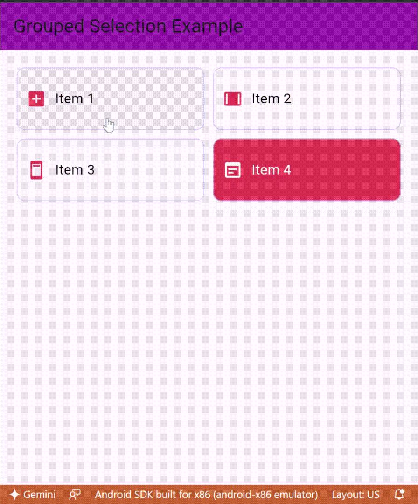

# GroupedSelection

A Flutter widget that allows grouped selection with single or multiple choices in a grid layout. It is customizable with icons and text, providing an interactive and visually appealing way to present selectable items.

## Features

- **Single or Multiple Selection:** Easily toggle between single or multiple item selection modes.
- **Customizable Icons:** Add left and/or right icons to each item for better visual representation.
- **Dynamic Grid Layout:** Specify the number of columns to control how items are arranged.
- **Selection Change Callback:** Get notified when the selected items change, allowing you to handle the selected data.

## Demo



## Installation

Add `grouped_selection` to your `pubspec.yaml` file:

```yaml
dependencies:
  grouped_selection: ^0.1.0
```

Then run `flutter pub get` to fetch the package.

## Usage

### Basic Example

Here’s a basic example of how to use `GroupedSelection` in your Flutter app:

```dart
import 'package:flutter/material.dart';
import 'package:grouped_selection/grouped_selection.dart';

void main() {
  runApp(const MyApp());
}

class MyApp extends StatelessWidget {
  const MyApp({super.key});

  @override
  Widget build(BuildContext context) {
    return MaterialApp(
      home: Scaffold(
        appBar: AppBar(title: const Text("Grouped Selection Example")),
        body: Center(
          child: GroupedSelection(
            items: [
              SelectionItem(text: 'Item 1'),
              SelectionItem(text: 'Item 2'),
              SelectionItem(text: 'Item 3'),
            ],
            columnCount: 2,
            onSelectionChanged: (selectedItems) {
              // Handle selection change
            },
          ),
        ),
      ),
    );
  }
}
```

### Customization

You can customize the widget with various parameters:

```dart
GroupedSelection(
  items: [
    SelectionItem(text: 'Item 1', leftIcon: Icons.star),
    SelectionItem(text: 'Item 2', rightIcon: Icons.check),
    SelectionItem(text: 'Item 3', leftIcon: Icons.star, rightIcon: Icons.check),
  ],
  columnCount: 3,
  multiple: true,
  onSelectionChanged: (selectedItems) {
    // Handle multiple selection change
    print('Selected items: $selectedItems');
  },
)
```

### Parameters

- **items:** A list of `SelectionItem` objects, each representing an item in the selection grid.
- **columnCount:** The number of columns in the grid. Default is `1`.
- **multiple:** A boolean that determines if multiple items can be selected. Default is `false`.
- **onSelectionChanged:** A callback function that is called whenever the selection changes. It provides a list of currently selected `SelectionItem` objects.

### SelectionItem Class

The `SelectionItem` class is used to define the properties of each selectable item:

```dart
SelectionItem({
  required this.text,
  this.leftIcon,
  this.rightIcon,
  this.isSelected = false,
});
```

- **text:** The label of the item.
- **leftIcon:** An optional icon displayed on the left of the text.
- **rightIcon:** An optional icon displayed on the right of the text (visible only when selected).
- **isSelected:** A boolean indicating whether the item is selected. This is managed internally by the `GroupedSelection` widget.

## Example

You can find a full example in the [example](example) directory.

## Roadmap

- [ ] Add support for custom colors.
- [ ] Improve accessibility features.
- [ ] Add animations for selection changes.

## Contributing

Contributions are welcome! Please open an issue or submit a pull request on GitHub if you find a bug or want to add new features.

## License

This project is licensed under the MIT License - see the [LICENSE](LICENSE) file for details.

## Contact

For any questions or suggestions, feel free to contact me at [nikaboue10@gmail.com](mailto:nikaboue10@gmail.com).

---

### Notes:

1. **License**: Make sure you include a `LICENSE` file in your repository.
2. **Roadmap**: You can modify the roadmap to reflect actual features you're planning to implement.
3. **Contact**: Replace the email address with your actual contact information.
4. **Contributing**: Include a `CONTRIBUTING.md` if you have specific guidelines for contributions.